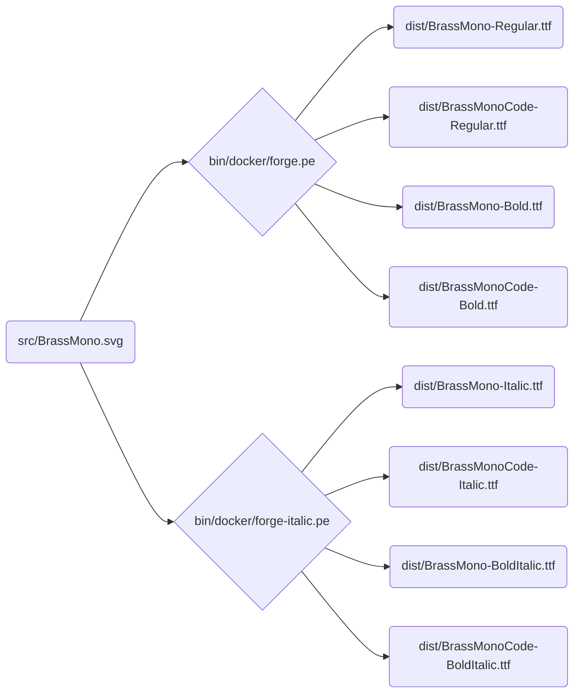

# Brass Mono

v1.101

[Download here](https://github.com/fonsecapeter/brass_mono/releases/latest/)

A free retro monospaced font inspired by 20th century electrical and mechanical design. It's open source, a solid choice for writing code, and pairs well with [krafftachrome](https://github.com/fonsecapeter/krafftachrome_visual_studio_code) or [shellectric colors](https://github.com/fonsecapeter/shellectric-color-scheme).

## Now with Code Ligatures!
This project actually contains 2 fonts: Brass Mono (no ligatures) and Brass Mono Code (with code ligatures), similar to [Fira Code ](https://github.com/tonsky/FiraCode) (but with way less ligatures).

### Origin Story

Fonts like this are all over the place. They're type-written in service manuals, stamped on elecrtical components, molded in steel, and pressed into fresh concrete. I made this font in an attempt to capture the beautifully functional, completely unplanned aesthetic that emerged as people who work with their hands built a world around them. I don't know that there's a specific font I'm talking about here, but you know it when you see it.

I made this font shortly after becoming a software engineer. While I loved writing in the blocky monospaced fonts that all code is written in, I couldn't shake the feeling that something was missing. Eventually I gave in and, despite not having any font making education, found some open source tools and got to work. I started out just tracing a couple other fonts I liked (wish I could remember which ones) and making modifications wherever I felt like it. As soon as I had enough letters, I started using my new creation, going back and tweaking as I went until, eventually, I decided Brass Mono was polished enough to share with the world, just like the open-source tools that let me create it.

It wasn't until after I got so used to reading and writing in this font that I learned I have dyslexia. I've tried a few dyslexia-focused fonts and, while I do believe work on these fonts is worthwhile, most of them feel no less choppy to me. Reading in Brass Mono still has it's challenges, but it feels like butter to my eyes. I'd love to take credit for cracking this problem, but I read somewhere that people with dyslexia exert less mental energy when reading their own handwriting, and I think this is just a digital version of that for me.

If you like Brass Mono as much as I do, give it a download and feel free to use it in your own creations, even commercial ones!

### Development

The build pipeline is fully scripted – main source file is `src/BrassMono.svg` which contains the svg glyphs that can be edited via the [inkscape svg font editor](https://inkscape-manuals.readthedocs.io/en/latest/creating-custom-fonts.html). From there, `ttf` font files are compiled into `/dist/BrassMono` using [fontforge](https://fontforge.org/docs/scripting/scripting.html).

This repo is built to [google-fonts spec](https://googlefonts.github.io/gf-guide/), which is enforced via [fontbakery](https://github.com/fonttools/fontbakery) (`bin/lint`). It's not fully compliant yet, but will be eventually!

To start working:
- install [docker](https://www.docker.com) if you haven't yet
- run `bin/init` to initialize git submodules
  - you can skip this if you cloned or pulled with `--recurse-submodules`
- create your docker image with `bin/build`
  - will compile and zip fonts
- edit `src/BrassMono.svg` in inkscape with changes
- run `bin/rebuild` to re-compile and zip fonts
- test compiled font quality with `bin/lint`
- manually test on your computer with `bin/install`
  - will update if already installed in ~/.fonts/BrassMonoFonts
  - or just open `/dist/BrassMono` with Font Book if you're using a mac
- run `bin/help` to see all project management commands
