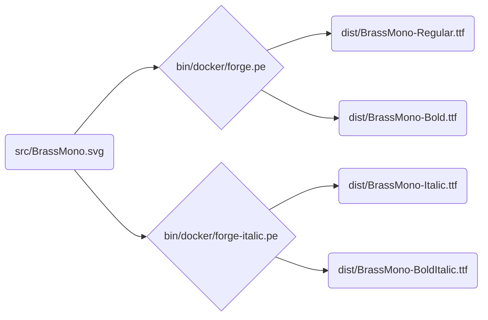

# Brass Mono

[Download here](https://github.com/fonsecapeter/brass_mono/releases/latest/)

A free retro monospaced font inspired by 20th century electrical and mechanical design. It's open source, a solid choice for writing code, and pairs well with [krafftachrome](https://github.com/fonsecapeter/krafftachrome_visual_studio_code) or [shellectric colors](https://github.com/fonsecapeter/shellectric-color-scheme).

### Origin Story

Fonts like this are all over the place. They're type-written in service manuals, stamped on elecrtical components, molded in steel, and pressed into fresh concrete. I made this font in an attempt to capture the beautifully functional, completely unplanned asthetic that emerged as industrial engineers and designers built a world around them. I don't know that there's a specific font I'm talking about here, just a sort of convergence on imparting important information that would be legible at small sizes, from great distances, or after years of wear tear. One that i couldn't help but notice when working with my hands, which is something I've always enjoyed doing any chance I can get.

When I became a software engineer, I entered a more virtual world. While I loved writing in the blocky monospaced fonts that all code is written in, something was missing. Maybe I just felt disconnected from the hands-on real world, or maybe I developed a taste for something that didn't exist in this one one. Either way, I found this itch so distracting that I couldn't focus on anything until I built the first iteration of this font and started using it. I'm not formally trained in font design, but that's never stopped me before. So I found some open source tools and started tracing a couple other fonts I liked (can't remember which ones) + made modifications all over. I kept using this font and tweaking it until, eventually, I decided Brass Mono was polished enough to share with the world, just like the open-source tools that let me create it.

It wasn't until after I got so used to seeing this font (everything on my computer is set up to use it) that I learned I have dyslexia. I've tried a few dyslexia-focused fonts and, while I do believe work on these fonts is worthwhile, most of them feel just as choppy to me. Reading in Brass Mono still has it's challenges, but it feels like butter to my eyes. I read somewhere that people with dyslexia exert less mental energy when reading their own handwriting. I'd like to think my attention to being extra legible at small sizes had something to do with it, but maybe this is just a digital version of that for me.

If you like it as much as I do, give it a download and feel free to use it in your own creations, even commercial ones!

### Development

The build pipeline is fully scripted – main source file is `src/BrassMono.svg` which contains the svg glyphs that can be edited via the [inkscape svg font editor](https://inkscape-manuals.readthedocs.io/en/latest/creating-custom-fonts.html). From there, `ttf` font files are compiled into `/dist/BrassMono` using [fontforge](https://fontforge.org/docs/scripting/scripting.html).

This repo is built to [google-fonts spec](https://googlefonts.github.io/gf-guide/), which is enforced via [fontbakery](https://github.com/fonttools/fontbakery) (`bin/lint`).

To start working:
- install [docker](https://www.docker.com) if you haven't yet
- run `bin/init` to initialize git submodules
  - you can skip this if you cloned or pulled with `--recurse-submodules`
- create your docker image with `bin/build`
  - will compile and zip fonts
- edit `src/BrassMono.svg` in inkscape with changes
- run `bin/rebuild` to re-compile and zip fonts
- test compiled font quality with `bin/lint`
- manually test on your computer with `bin/install`
  - will update if already installed in ~/.fonts/BrassMonoFonts
  - or just open `/dist/BrassMono` with Font Book if you're using a mac
- run `bin/help` to see all project management commands
