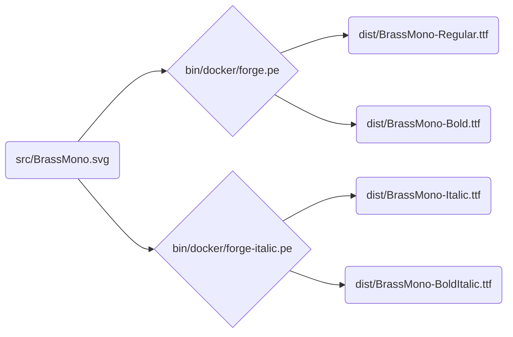

# Brass Mono

[Download here](https://github.com/fonsecapeter/brass_mono/releases/latest/)

A free retro monospaced font inspired by 20th century electrical and mechanical design. It's open source, a solid choice for writing code, and pairs well with [krafftachrome](https://github.com/fonsecapeter/krafftachrome_visual_studio_code) or [shellectric colors](https://github.com/fonsecapeter/shellectric-color-scheme).

Fonts like this are all over the place. They're type-written in service manuals, stamped on elecrtical components, embossed in steel, and pressed into fresh concrete. I started this font in an attempt to capture the beautifully functional, completely unplanned asthetic that emerged as industrial engineers and designers built a world around them. One that I, and pretty much anyone else who works with their hands love engaging in.

When I become a software engineer, I entered a more virtual one. While I loved writing in the blocky monospaced fonts that all code is written in, something was missing. Maybe I just felt disconnected from the hands-on real world, or maybe I had just developed a taste for something that didn't exist in this one one. Either way, I found it so distracting that I couldn't focus on anything until I built the first iteration of this font and started using it. I'm not formally trained in font design, but I found some open source tools and and scripted an automated pipeline around it all. Eventually I decided to share Brass Mono with the world, in true open-source fashion.

It wasn't until after I got so used to using this font (everything on my computer is set up to use it) that I learned I have dyslexia. There have been a lot of dyslexia-focused fonts and, while I do believe its a worthwile area to keep working on, most of them just don't make a difference for me personally. It has, however, been demonstrated that people with dyslexia exert less mental energy when reading their own handwriting. I did spent a lot of time tuning this font to be easy to read for my taste, but maybe this is just a digital version of that for me. If you like it too, give it a downlaod if and feel free to use it on your own creations!

### Development

The build pipeline is fully scripted – main source file is `src/BrassMono.svg` which contains the svg glyphs that can be edited via the [inkscape svg font editor](https://inkscape-manuals.readthedocs.io/en/latest/creating-custom-fonts.html). From there, `ttf` font files are compiled into `/dist/BrassMono` using [fontforge](https://fontforge.org/docs/scripting/scripting.html).

This repo is built to [google-fonts spec](https://googlefonts.github.io/gf-guide/), which is enforced via [fontbakery](https://github.com/fonttools/fontbakery) (`bin/lint`).

To start working:
- first run `bin/init` to initialize git submodules
  - you can skip this if you cloned or pulled with `--recurse-submodules`
- create your docker image with `bin/build`
  - will compile and zip fonts
- edit `src/BrassMono.svg` in inkscape with changes
- run `bin/rebuild` to re-compile and zip fonts
- test compiled font quality with `bin/lint`
- manually test on your computer with `bin/install`
  - will update if already installed in ~/.fonts/BrassMonoFonts
  - or just open `/dist/BrassMono` with Font Book if you're using a mac
- run `bin/help` to see all project management commands
