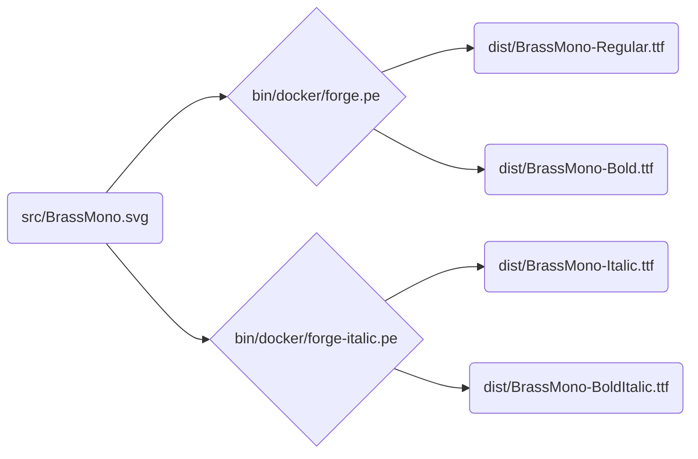

# Brass Mono

[Download here](https://github.com/fonsecapeter/brass_mono/releases/latest/)

A free retro monospaced font inspired by 70's electrical and mechanical design. It's open source, a solid choice for writing code, and pairs well with [krafftachrome](https://github.com/fonsecapeter/krafftachrome_visual_studio_code) or [shellectric colors](https://github.com/fonsecapeter/shellectric-color-scheme).

### Development

The build pipeline is fully scripted – The main source file is `src/BrassMono.svg` which containst the svg glyphs that can be edited via the [inkscape svg font editor](https://inkscape-manuals.readthedocs.io/en/latest/creating-custom-fonts.html). From there, `ttf` font files are compiled into `/dist/BrassMono` using around [fontforge](https://fontforge.org/docs/scripting/scripting.html).

This repo is built to [google-fonts spec](https://googlefonts.github.io/gf-guide/), which is enforced via [fontbakery](https://github.com/fonttools/fontbakery) (`bin/lint`).

To start working:
- first run `bin/init` to set up the dependencies
  - you can skip this if you cloned or pulled with `--recurse-submodules`
- edit `src/BrassMono.svg` in inkscape
- compile and zip final fonts with `bin/build`
- test font quality with `bin/lint`
- manually test with `bin/install` to install the fonts to your user account
  - will update if already installed in ~/.fonts/BrassMonoFonts
  - or just open `/dist/BrassMono` with Font Book on mac
- run `bin/help` to see all project management commands
